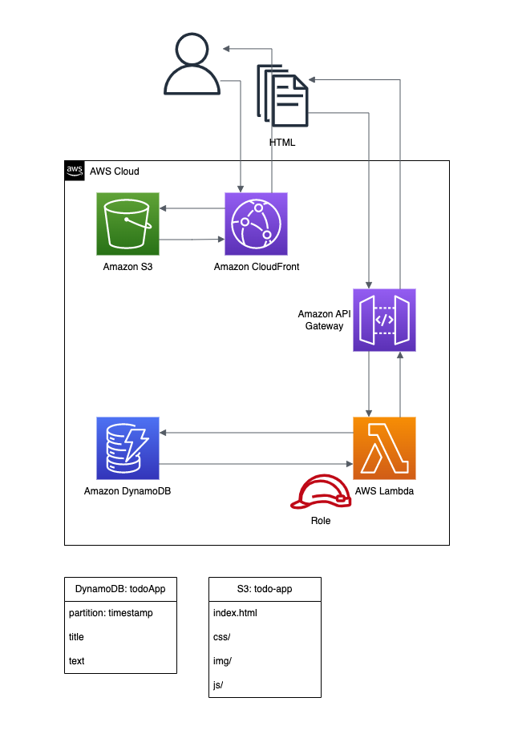
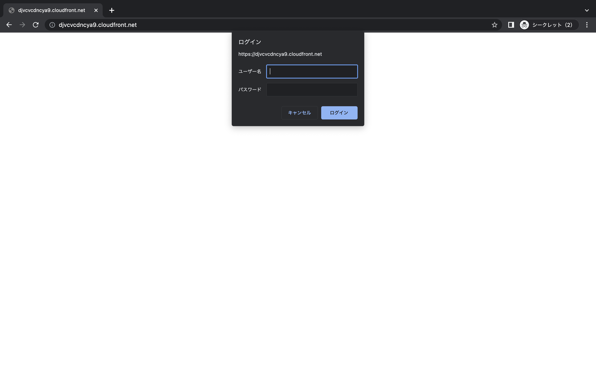
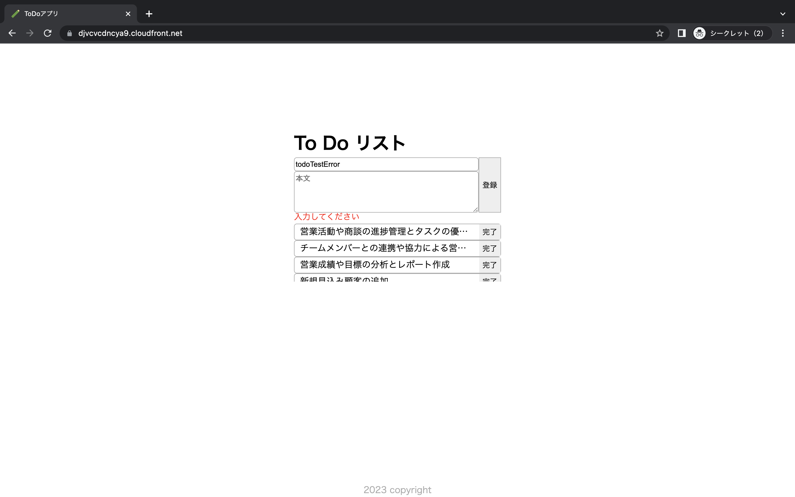
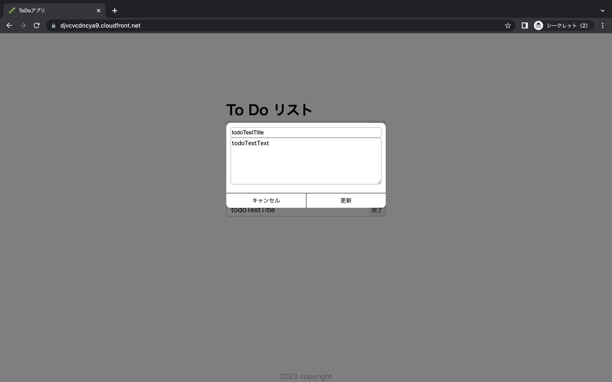
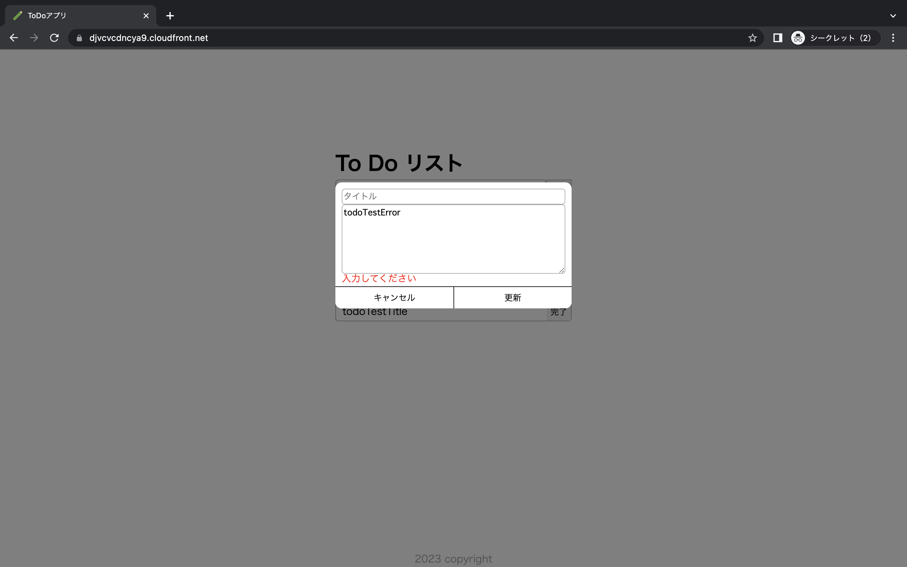
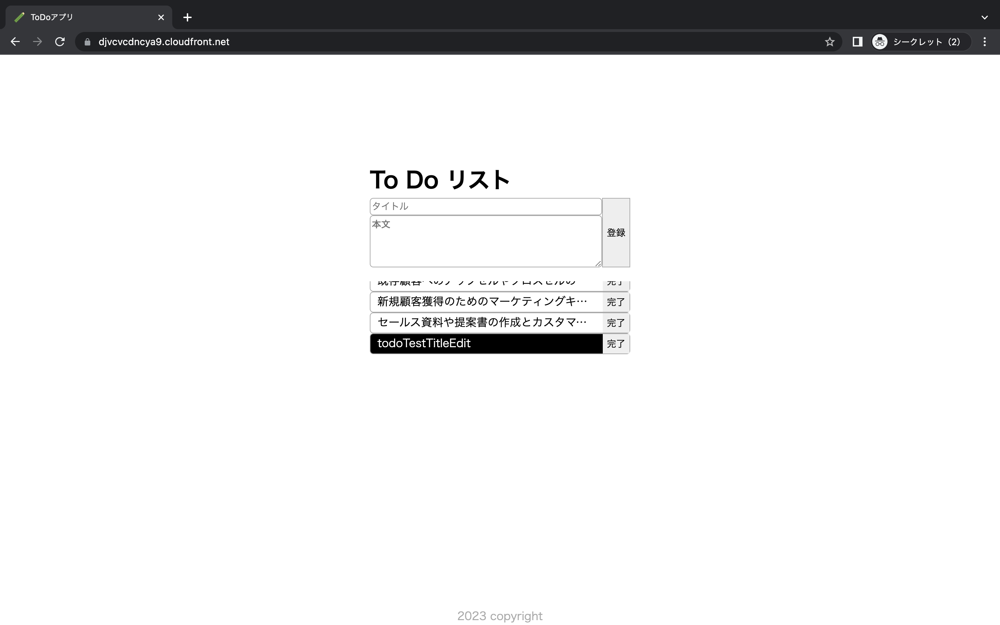
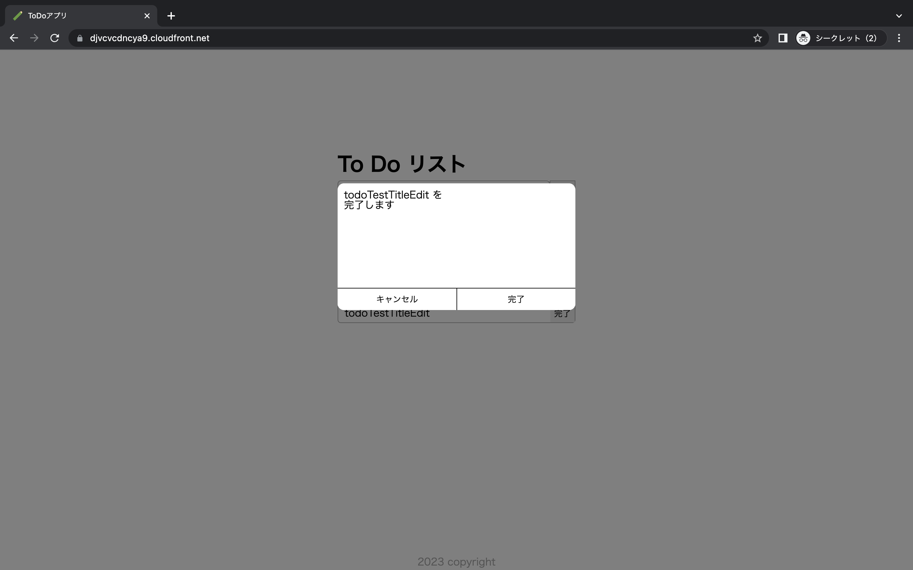
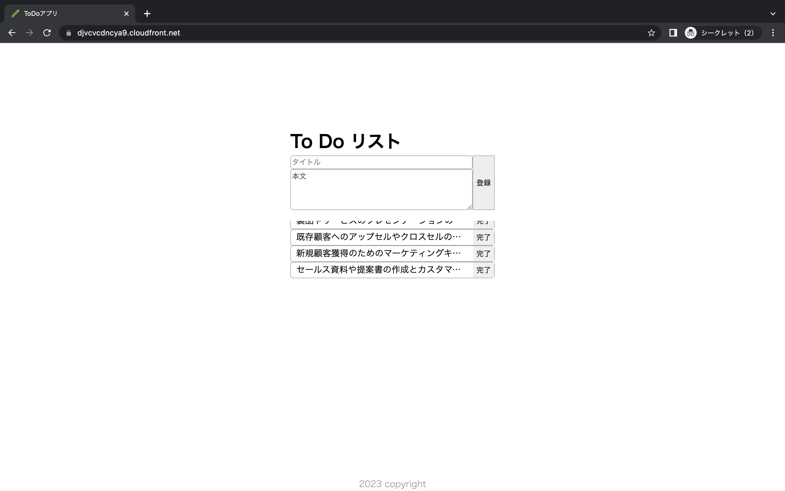

# ToDoアプリ



## アプリケーション概要
このアプリケーションの構成は、以下の通りです。

- **ユーザーへのフロントエンド提供 :**<br>
アプリのフロントエンドは、Amazon S3に格納されており、Amazon CloudFrontを経由してユーザーに提供されます。<br>
CloudFrontでは、Basic認証が設定されており、認証済みのユーザーのみアクセスできます。

- **API Gateway経由でのLambda処理 :**<br>
フロントエンドからのリクエストは、Amazon API Gatewayを介してAWS Lambdaの関数にルーティングされます。<br>
Lambda関数は、要求された処理を実行します。

- **Lambda関数とDynamoDBの連携 :**<br>
Lambda関数は、Amazon DynamoDBと接続してデータの読み書きを行います。<br>
AWS IAMのIAMロールを使用して、Lambda関数が必要なDynamoDB操作のみを実行できるように制限されています。


また、このアプリケーションの展開には、添付されたSAMテンプレートかCDKのスタックファイルを使用することができます。

- **SAMでの展開 :**<br>
AWS SAMのテンプレート(template.yaml)を使用してアプリケーションを展開します。<br>
SAMテンプレートには、アプリケーションのリソース(S3バケット、CloudFrontディストリビューション、API Gateway、Lambda関数、IAMロールなど)の定義が含まれています。<br>
SAM CLIを使用して、SAMテンプレートをデプロイするためのコマンドを実行します。

- **CDKでの展開 :**<br>
AWS CDKのスタックファイル(todo_app_cdk-stack.ts)を使用してアプリケーションを展開します。<br>
CDKスタックファイルには、アプリケーションのリソースをプログラム的に定義するコードが含まれています。<br>
CDK CLIを使用して、CDKスタックをデプロイするためのコマンドを実行します。

展開に必要なコマンドや手順は、後の項目にて詳細に記載します。

## アプリケーションの操作
<br>
Basic認証にユーザー名とパスワードを入力します。

<br>
画面の上から、アプリタイトル、新規登録、一覧で構成されています。<br>
新規登録はタイトル、詳細、登録で構成されています。<br>
登録を押下すると、一覧に追加されます。<br>
一覧はtodoのタイトルと、そのtodoの完了で構成されています。<br>
一覧は4行以上になると、上下スクロールする枠で表示されます。<br>
各todoのタイトルを押下すると、詳細が表示されます。<br>
各todoの完了を押下すると、完了の確認が表示されます。

<br>
登録を押下したときにタイトルか詳細が、空欄かスペースのみだと登録に失敗します。

<br>
登録に成功すると、一覧の一番下に追加されます。

<br>
詳細では、詳細閲覧と更新ができます。<br>
詳細はタイトル、詳細、キャンセル、更新で構成されています。<br>
更新を押下すると、一覧に戻ります。

<br>
更新を押下したときにタイトルか詳細が、空欄かスペースのみだと更新に失敗します。

<br>
更新に成功すると、既存のtodoを更新して一覧に戻ります。

<br>
各todoの完了を押下すると、完了の確認が表示されます。<br>
完了確認はキャンセル、完了で構成されています。<br>
完了確認で完了を押下すると、一覧に戻ります。

<br>
完了確認で完了に成功すると、既存のtodoが一覧から非表示になり一覧に戻ります。

## アプリケーションの処理詳細
このアプリケーションのフロントエンドは、S3の静的ホスティングバケットに格納されています。<br>
ユーザーは、フロントエンドにアクセスするためにCloudFrontを経由します。<br>
CloudFrontのBasic認証は、CloudFront Functionを使用して設定されています。<br>
そのため、認証済みのユーザーのみがアクセスできるようになっています。

フロントエンドからは、fetch関数を用いて非同期でAPI Gatewayにリクエストを行います。<br>
API Gatewayは、リクエストメソッドごとに異なるLambda関数を起動します。<br>
起動されたLambda関数に応じて、DynamoDBのテーブルデータを取得、追加、更新、削除する処理を行います。

Lamda関数に付与されているIAMロールは、上記の処理のみを許可するように定義されています。<br>
テーブルのアイテムを取得、追加、更新、削除する権限が与えられていますが、他の操作には制限が設けられています。

## SAMを使用した展開手順
使用端末はMacを想定した手順です。<br>
事前準備の詳細は[こちら](https://docs.aws.amazon.com/ja_jp/serverless-application-model/latest/developerguide/serverless-getting-started.html)を参考ください。<br>
また、下記手順のうち実施済みのものは各自の判断で省略してください。

1. 下記コマンドでAWS CLIがインストール済みであることを確認する<br>
インストールされていない場合は、事前準備の詳細を参考にインストールを行なってください。
```
$ aws --vertion
```

2. AWS認証情報を本体に設定済みであることを確認する<br>
未設定の場合は、事前準備の詳細を参考に設定を行なってください。

3. 下記のいずれかでSAM CLIをインストールする
```
Homebrewを使用してインストールする場合
$ brew install aws/tap/aws-sam-cli
```
```
パッケージでインストールする場合
事前準備の詳細を参考にmacOS/GUIの項目でインストールを行なってください。
```

4. 下記コマンドでSAMアプリケーションの初期化を行う
```
任意のフォルダに遷移します。
$ sam init
選択はテンプレートで問題ないです。
  AWS Quick Start Templates
  Hello World Example
  任意のプロジェクト名
```

5. 初期化したアプリケーションを下記の内容に変更する
```
作成したアプリケーション/template.yaml -> todoAppSam/template.yaml
todoAppSam/samTodoAppFunctions/をアプリケーションフォルダ直下に追加します。
```

6. 下記コマンドでアプリケーションをビルドする
```
アプリケーションフォルダ直下で実行します。
$ sam build
```

7. 下記コマンドでアプリケーションをAWSにデプロイする
```
$ sam deploy --guided
```

8. todoAppSam/front/js/urls.jsに作成されたcloudFrontのURLを追記する

9. 作成されたtodo-app-samバケットにファイル、フォルダを追加する<br>
todoAppSam/front/配下のファイル、フォルダを、ファイル名、フォルダ名をそのままで追加してください。

10. 下記コマンドでアプリケーションをAWSから削除する
```
$ sam delete
todo-app-samバケットは削除されないので、手動で削除してください。
```

## CDKを使用した展開手順
使用端末はMacを想定した手順です。<br>
使用言語はTypeScriptです。<br>
事前準備の詳細は[こちら](https://docs.aws.amazon.com/ja_jp/cdk/v2/guide/getting_started.html)を参考ください。<br>
また、下記手順のうち実施済みのものは各自の判断で省略してください。

1. 下記コマンドでNode.jsがインストール済みであることを確認する<br>
インストールされていない場合は、各自でNode.jsのインストールを行なってください。
```
$ node --version
```

2. 下記コマンドでTypeScriptがインストール済みであることを確認する
```
$ tsc -v
```
```
インストールされていない場合は、このコマンドを実行してください。
$ npm -g install typescript
```

3. 下記コマンドでCDK CLIをインストールする
```
$ npm install -g aws-cdk
```

4. 下記コマンドでCDKのスタックテンプレートを保存するためのS3バケットを自動作成する<br>
ACCOUNT-NUMBER, REGIONは、各自のAWSアカウント番号と使用したいリージョンに置き換えて実行してください。
```
$ cdk bootstrap aws://ACCOUNT-NUMBER/REGION
```

5. 任意のフォルダを作成する

6. 作成したフォルダに移動する

7. 下記コマンドでCDKアプリケーションの初期化を行う
```
$ cdk init app --language typescript
```

8. 初期化したアプリケーションを下記の内容に変更する
```
作成したフォルダ/lib/フォルダ名-stack.ts -> todoAppCdk/lib/todo_app_cdk-stack.ts
todoAppCdk/cdkTodoAppFunctions/を作成したフォルダ直下に追加します。
todoAppCdk/front/を作成したフォルダ直下に追加します。
```

9. libフォルダに移動して、下記コマンドで.tsファイルをコンパイルする
```
$ npm run build
```

10. 作成したフォルダ直下に移動して、下記コマンドでテンプレートを合成する
```
$ cdk synth
```

11. 下記コマンドでアプリケーションをAWSにデプロイする
```
$ cdk deploy
```

12. ※手順12. 13. は初回スタック作成時のみ実施する作業<br>
todoAppCdk/front/js/urls.jsに作成されたcloudFrontのURLを追記する

13. 作成されたtodo-app-cdkバケットのjs/urls.jsファイルを、手順12. で作業したtodoAppCdk/front/js/urls.jsファイルに更新する

14. 下記コマンドでアプリケーションをAWSから削除する
```
$ cdk destroy
todo-app-cdkバケットは削除されないので、手動で削除してください。
```
