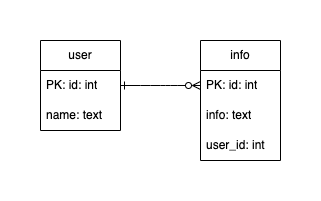

# DBのSQL文のためのアプリ



## アプリケーションについて
このアプリケーションを利用すると任意のDBにCRUDの操作を行えます。<br>
<br>
具体的には、userテーブルに対してCRUの操作を行えます。<br>
infoテーブルに対してCRDの操作を行えます。<br>
<br>
また、userテーブル対infoテーブルのテーブル結合の確認も行えます。

## 環境と必要な準備
### 環境
Node.js, MySQL

### 準備
1. Node.jsをインストールする

2. MySQLをインストールする

3. 任意のDBを作成する

4. 作成したDBにuserテーブルとinfoテーブルを作成する<br>
テーブル構成は一番上の画像の通りにします。

5. 任意のフォルダを作成する

6. 作成したフォルダに遷移する

7. 下記コマンドを実行する
```
$ npm init -y
$ npm install express mysql2 body-parser
```

8. 作成したフォルダにfrontフォルダをフォルダごとコピーする<br>
node_modulesと同じ階層にコピーします。

9. app.jsファイルをコピーする<br>
node_modulesと同じ階層にコピーします。

10. front/others/index.jsファイルのDB情報を接続したいDB情報に書き換える
